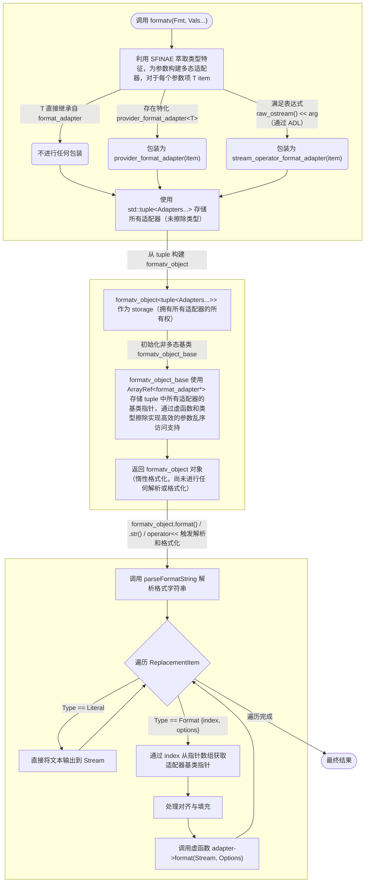

## 一、动机

最近我在开发 cxx-decorator 项目，该项目基于 ClangAST 和 libtooling 实现类似 Python 语言中的装饰器语法特性。

在开发期间，由于调试输出和日志记录等需求，需要频繁对 `SmallVector`、`StringRef`、`Decl*` 等 LLVM / ClangAST 核心类型进行格式化，原本我计划为这些类型实现 C++20 标准格式化支持（即 `std::format`），不过在分析设计如何将其与 LLVM 的 `raw_ostream` 体系合理集成时，我发现原来 LLVM 已经提供了一个功能完备的 `formatv` 格式化函数。

出于对 LLVM 如何实现类型安全格式化的好奇，也为了探究其与 `std::format` 在底层设计上的异同，我决定深入剖析其源码实现。

---

## 二、使用方式

在剖析实现之前，有必要简单介绍一下 `llvm::formatv` 的使用方式，总体而言与 `std::format` 非常相似，差异主要集中在在类型特定的格式符上。

---

### 1. 基础示例

```cpp
// 位置索引
formatv("{0} {1}", "a", "bb")      // 输出："a bb"
// 参数复用
formatv("{0} {1} {0}", "a", "bb")  // 输出："a bb a"
// 布局控制（右对齐，宽度为 5，默认填充空格）
formatv("{0, +5}", "a")            // 输出："    a"
// 布局控制（居中，宽度为 5，填充字符'-'）
formatv("{0,-=5}", "a")            // 输出："--a--"
```

---

### 2. 格式化字符串语法

`llvm::formatv` 使用包含替换序列（Replacement Sequence）的格式字符串，其核心语法结构如下：

```text
{ index [, layout] [: format] }
```
{: .nolineno }

1. `index`**（必填）**：非负整数，对应参数包中参数的索引位置，同一索引可以在格式字符串中多次引用（如 `"{0} {1} {0}"`）。
2. `layout`（选填）：语法格式为 `[[char]loc]width`，用于控制输出内容的对齐、宽度和填充。
3. `format`（选填）：类型特定的格式化选项。

> 与 `std::format` 和 `std::vformat` 不同，`llvm::formatv` 必须指定 `index`，否则行为未定义。
{: .prompt-warning }

布局（`layout`）用于控制字段在可用空间内的展示方式，只有指定了 `width`，对齐和填充才会生效：
  - `width`：字段宽度。正整数，如果内容长度小于此值，将根据 `loc` 和 `char` 进行填充，否则直接输出内容，不进行填充。
  - `loc`：对齐位置。`-` 左对齐，`=` 居中对齐，`+` 右对齐。
  - `char`：填充字符。默认为空格。


转义字符 `{` 和 `}` 是保留字符，如果要在输出中包含大括号，必须进行转义，使用双大括号 `{{` 来输出一个 `{` 纯文本。


---

### 3. 内置格式化选项

`llvm::formatv` 的格式说明符（即 `{index:format}` 中的 `format` 部分）根据目标类型遵循不同的文法。

#### 3.1 整数类型（Integral）

整数的格式字符串文法为：**`[style][digits]`**

- `style`：决定输出格式。如十六进制、千分位等，见下表。
- `digits`：正整数（`0-99`）。对于十六进制（`x/X`），表示最小输出位数，如果数值长度不足，会在左侧补 `0`，对于其他样式，该参数被忽略。

| 样式（`style`） | 说明                        | 输入     | 格式串 | 输出      |
| :-------------- | :-------------------------- | :------- | :----- | :-------- |
| **`D` / `d`**   | 十进制（默认）              | `100000` | `D`    | `100000`  |
| **`N` / `n`**   | 千分位分隔                  | `123456` | `N`    | `123,456` |
| **`x+` / `x`**  | 十六进制（小写，`0x` 前缀） | `42`     | `x`    | `0x2a`    |
| **`X+` / `X`**  | 十六进制（大写，`0x` 前缀） | `42`     | `X+4`  | `0x002A`  |
| **`x-`**        | 十六进制（小写，无前缀）    | `42`     | `x-`   | `2a`      |
| **`X-`**        | 十六进制（大写，无前缀）    | `42`     | `X-`   | `2A`      |

#### 3.2 浮点类型（Floating Point）

浮点数的格式字符串文法为：**`[style][precision]`**

- `style`：决定浮点数的表现形式。小数、百分比、科学计数，见下表。
- `precision`：正整数（`0-99`）。指定小数点后的位数，如果省略，科学计数法（`E/e`）默认为 6 位，其他（`F/P`）默认为 2 位。

| 样式（`style`） | 说明             | 输入    | 格式串 | 输出                   |
| :-------------- | :--------------- | :------ | :----- | :--------------------- |
| **`F` / `f`**   | 小数（默认）     | `1.0`   | `F`    | `1.00`（默认2位）      |
| **`P` / `p`**   | 百分比           | `0.05`  | `P`    | `5.00%`                |
| **`E`**         | 科学计数（大写） | `12345` | `E`    | `1.234500E+04`         |
| **`e`**         | 科学计数（小写） | `12345` | `e3`   | `1.235e+04`（指定3位） |

#### 3.3 布尔类型（Boolean）

默认样式为 **`t`**，即：`true / false`

| 样式（`style`） | 说明                 | `true` 输出 | `false` 输出 |
| :-------------- | :------------------- | :---------- | :----------- |
| **`t`**         | true / false（默认） | `true`      | `false`      |
| **`T`**         | TRUE / FALSE         | `TRUE`      | `FALSE`      |
| **`y`**         | yes / no             | `yes`       | `no`         |
| **`Y`**         | YES / NO             | `YES`       | `NO`         |
| **`D` / `d`**   | 0 / 1                | `1`         | `0`          |

#### 3.4 指针类型（Pointer）

指针主要按十六进制地址输出，文法结构类似整数。

| 样式（`style`） | 说明                     | 示例输出                    |
| :-------------- | :----------------------- | :-------------------------- |
| **`x` / `X`**   | 十六进制（带前缀，默认） | `0xdeadbeef` / `0xDEADBEEF` |
| **`x-` / `X-`** | 十六进制（无前缀）       | `deadbeef` / `DEADBEEF`     |

#### 3.5 范围与容器（Ranges / Containers）

将任意 Ranges 打印为由 `separator` 分隔、以 `element_style` 指定的格式显示的元素序列，其 BNF 文法如下：

```haskell
range_style     ::= [separator] [element_style]
separator       ::= "$" delimeted_expr
element_style   ::= "@" delimeted_expr
delimeted_expr  ::= "[" expr "]" | "(" expr ")" | "<" expr ">"
expr            ::= <any string not containing delimeter>
```

- 分隔符（**`$`**）：插入在容器内相邻两个元素之间的字符串，未指定时默认以空格分隔。
- 元素样式（**`@`**）：指定容器内元素的格式说明符（即上述的整数、浮点等规则），未指定时以默认格式显示。

| 场景              | 格式串               | 说明                            | 示例输出 |
| :---------------- | :------------------- | :------------------------------ | :------- |
| 默认              | **`{0}`**            | 默认空格分隔，默认元素格式      | `255 10` |
| 分隔符            | **`{0:$[,]}`**       | 以逗号分隔                      | `255,10` |
| 元素格式          | **`{0:@[x-2]}`**     | 以小写十六进制并补齐到 2 位显示 | `ff 0a`  |
| 分隔符 + 元素格式 | **`{0:$[, ]@[X-]}`** | 以 `, ` 分隔，大写十六进制显示  | `FF, A`  |

---

## 三、实现解析

LLVM 的 `formatv` 实现可以分为三个主要阶段：编译期参数适配、对象构建与存储、运行时解析与格式化。

> 以下所有代码片段已适当简化，在保持逻辑等价的前提下提高可读性，以便于读者理解。
{: .prompt-info }

---

### 1. 编译期参数适配

`formatv` 本身的实现非常简单，只是依次对每个待格式化参数进行包装，再将包装结果以 tuple 形式连同 `Fmt`（格式串）一起打包进 `formatv_object` 中返回：

```cpp
template <typename... Ts>
auto formatv(const char *Fmt, Ts&&... Vals) {
  return formatv_object{
    Fmt,
    make_tuple(build_format_adapter(forward<Ts>(Vals))...)
  };
}
```

---

包装逻辑都集中在 `build_format_adapter` 中，这是一个重载的函数模板，利用 SFINAE 特性对于不同类型应用不同的格式化适配器：

> 我将其翻译成了等价的 `constexpr if` + `concepts` 实现以提高可读性。
{: .prompt-info }

```cpp
template <typename T>
auto build_format_adapter(T&& Item)
{
  if constexpr (is_base_of_v<format_adapter, remove_reference_t<T>>) {
    return Item;

  } else if (HasFormatProvider<T>) {
    return provider_format_adapter<T>{forward<T>(Item)};

  } else if (HasStreamOperator<T>) {
    static_assert(
      !is_same_v<Error, remove_cv_t<T>>,
      "llvm::Error-by-value must be wrapped in fmt_consume() for formatv");
    return stream_operator_format_adapter<T>{forward<T>(Item)};

  } else {
    return missing_format_adapter<T>{};
  }
}

template <typename T>
concept HasFormatProvider =
  requires(decay_t<T> const& val, raw_ostream& stream, StringRef options)
{
  { format_provider<decay_t<T>>::format(val, stream, options) } -> same_as<void>;
};

template <typename T>
concept HasStreamOperator =
  requires(raw_ostream& os, decay_t<T> const& val)
{
  { os << val } -> same_as<raw_ostream&>;
};
```

包装逻辑有四种，优先级从高到低：

  1. 如果 `T` 继承自 `format_adapter`，则不进行任何包装，直接返回 `Item` 本身。

  2. 如果存在 `format_provider<T>` 类模板特化，且该特化定义了以 `(T const&, raw_ostream&, StringRef)` 为参数的名为 `format` 的成员函数，则使用 `provider_format_adapter` 进行包装。

  3. 如果能通过 ADL 查找到适用于 `T` 的 `operator<<` 重载，且该重载接受 `(raw_ostream&, T const&)` 并返回 `raw_ostream&`，则使用 `stream_operator_format_adapter` 进行包装。

  4. 否则使用 `missing_format_adapter` 进行包装。

> **关于 `llvm::Error` 的特殊保护**
>
> `llvm::Error` 具有严格的“强制检查”语义，要求错误对象在析构前必须被显式消费（Checked / Consumed），否则会导致程序崩溃。
>
> 当 `Error` 对象以**右值**传递给 `formatv` 时（例如 `formatv("Result: {0}", fallible_call())`），`stream_operator_format_adapter` 会接管其所有权，由于通用的流适配器仅执行打印操作而不消费错误对象，当适配器销毁时其内部持有的 `Error` 对象析构会触发断言。
>
> 因此 `formatv` 禁止右值 `Error` 对象的直接格式化，强制要求通过 `fmt_consume()` 进行包装（如 `formatv("{0}", fmt_consume(err))`），该函数底层使用 `ErrorAdapter`，在打印错误信息后会正确消费错误对象。按**左值**传递仅涉及引用访问，不发生所有权转移，故不受此限制。
{: .prompt-warning }

> 如果要为自定义类型或第三方类型实现 `vformat` 支持，应首选特化 `format_provider` 的方式，在全局范围内定义 `T` 的默认格式化行为。
>
> 由于 `raw_ostream` 的流操作符接口不支持传递额外状态，所以 `stream_operator_format_adapter` 适配器不支持 `options` 参数，故不作为首选方式。
{: .prompt-info }

`format_adapter` 是一个多态基类，提供了 `format` 纯虚函数，`provider_format_adapter` 和 `stream_operator_format_adapter` 都继承自 `format_adapter`，它们重写的 `format` 将实际操作转发给 `format_provider<T>::format()` 和 `operator<<`，这使得所有满足条件的类型 `T` 经包装后都具备了统一的接口：

```cpp
struct format_adapter {
  virtual ~format_adapter() = default;
  virtual void format(raw_ostream& S, StringRef Options) = 0;
};

template <typename T>
struct provider_format_adapter : format_adapter {
  T Item;
  void format(raw_ostream& S, StringRef Options) override {
    format_provider<decay_t<T>>::format(Item, S, Options);
  }
};

template <typename T>
struct stream_operator_format_adapter : format_adapter {
  T Item;
  void format(raw_ostream& S, StringRef) override { S << Item; }
};

template <typename T> class missing_format_adapter;
```

当类型 `T` 不满足前三种情况时就会实例化 `missing_format_adapter`，这是一个**不完整类型**，对其进行实例化会触发编译期报错（类型安全），并且它的类型名本身就是清晰的诊断信息。

> 特化 `format_provider` 的方式也存在一定局限性，即无法覆盖已受支持类型的默认格式化行为。对于这种情况，应通过继承 `llvm::FormatAdapter<T>`（`format_adapter` 的浅包装类模板）并重写 `format` 虚函数来创建一个自定义格式化适配器，在调用 `formatv` 时不直接传递 `T` 类型对象，而是传递适配后的对象（例如 `formatv("{0}", format_int_custom{42}`)），这种方式也适用于在特定上下文中临时修改类型的默认格式化行为，为这套格式化机制提供了灵活性。
{: .prompt-info }

> **FIXME**: 按左值传递参数会使 `xxx_adapter` 存储参数的引用而非转移所有权，要小心悬垂引用问题
{: .prompt-warning }

---

### 2. 对象构建与内联存储

从上一阶段构建的 `std::tuple` 对象初始化一个轻量级的 `formatv_object` 中间对象，并不真正执行格式化。


```cpp
class formatv_object_base {
protected:
  StringRef Fmt;
  ArrayRef<format_adapter*> Adapters;

  formatv_object_base(StringRef Fmt, ArrayRef<format_adapter*> Adapters)
      : Fmt(Fmt), Adapters(Adapters) {}

  // ...
};

template <typename Tuple>
class formatv_object : public formatv_object_base {
  Tuple Parameters;
  array<format_adapter*, tuple_size_v<Tuple>> ParameterPointers;

public:
  formatv_object(StringRef Fmt, Tuple&& Params)
      : formatv_object_base(Fmt, ParameterPointers),
        Parameters(move(Params)) {
    ParameterPointers = apply([](Ts&... xs) { return {{&xs...}}; }, Parameters);
  }

  // ...
};
```


LLVM 利用 `formatv_object` 及其基类 `formatv_object_base`，在不进行堆分配的前提下，实现了类型安全的变参存储和运行时随机访问：

- 存储层（`formatv_object`）
    - 本身存储在栈上，通过 tuple 成员内联存储所有适配器对象（持有所有权），避免了堆分配带来的额外性能开销。
    - 通过多态基类指针将异构元组转换为同构数组，这是后续解析阶段能够处理 `{1} {0}` 这种乱序格式符的前提。

- 逻辑层（`formatv_object_base`）
    - 采用模板类继承非模板基类的设计，将格式化逻辑分离进基类中，最大限度地减轻了模板实例化导致的代码膨胀问题（加快编译速度的同时也能提高指令缓存的命中率）。

由于 `std::tuple` 仅支持编译期索引访问（通过 `std::get<N>`），而 `formatv` 的格式化字符串在运行期解析，这就需要一种通过运行期索引访问适配器参数的能力。

具体而言，LLVM 利用 `std::apply` 将 tuple 展开，依次获取每个适配器元素的地址，并存储进类型为 `std::array<format_adapter*>` 的指针数组，建立了从“编译期派生类元组索引”到“运行期基类数组索引”的映射，由此实现运行期随机访问适配器对象。

---

### 3. 运行时解析与格式化

`formatv` 函数最终返回的是 `formatv_object` 对象，此对象承载了格式化所需的所有上下文信息，但尚未执行任何字符串解析和格式化操作。

只有当用户显式调用 `.str()` / `operator std::string()` 或将其通过流操作符传输给 `raw_ostream` 时，才会调用 `format` 成员函数真正开始解析，这种惰性解析和格式化机制可以避免不必要的字符串拼接和内存分配开销。

---

#### 3.1 核心数据结构：`ReplacementItem`

解析器将格式字符串拆解为一系列的替换项（`ReplacementItem`），每个替换项要么是无需处理的纯文本（`Literal`），要么是具体的格式符（`Format`）：

```cpp
struct ReplacementItem {
  ReplacementItem() = default;
  explicit ReplacementItem(StringRef Literal)
      : Type(ReplacementType::Literal), Spec(Literal) {}
  ReplacementItem(StringRef Spec, size_t Index, size_t Align, AlignStyle Where,
                  char Pad, StringRef Options)
      : Type(ReplacementType::Format), Spec(Spec), Index(Index), Align(Align),
        Where(Where), Pad(Pad), Options(Options) {}

  ReplacementType Type = ReplacementType::Empty;
  StringRef Spec;     // 包含左右大括号的完整格式符，或纯文本
  size_t Index = 0;   // 参数索引
  size_t Align = 0;   // 对齐宽度
  AlignStyle Where = AlignStyle::Right; // 对齐方向
  char Pad = 0;       // 填充字符
  StringRef Options;  // 类型特定的自定义格式化选项
};
```

---

#### 3.2 格式字符串解析

##### **A. 驱动层 `parseFormatString`**

这是解析的入口，负责驱动格式串的解析工作，此函数采用线性扫描的方式，循环调用 `splitLiteralAndReplacement`，将格式串 `Fmt` 切分为 `ReplacementItem` 列表。

```cpp
SmallVector<ReplacementItem, 2>
formatv_object_base::parseFormatString(StringRef Fmt) {
  SmallVector<ReplacementItem, 2> Replacements;
  ReplacementItem I;
  while (!Fmt.empty()) {
    // 每次处理一个 `Item`，并将 `Fmt` 更新为剩余部分
    std::tie(I, Fmt) = splitLiteralAndReplacement(Fmt);
    if (I.Type != ReplacementType::Empty)
      Replacements.push_back(I);
  }
  return Replacements;
}
```

> **FIXME**: `StringRef` 避免拷贝
{: .prompt-warning }

> **FIXME**: `SmallVector` 长度为 2 对 `formatv("XXX: {}")` 场景优化
{: .prompt-warning }

---

##### **B. 词法解析层 `splitLiteralAndReplacement`**


此函数负责在字符串流中定位下一个格式符的边界，核心逻辑是处理转义和检查括号的匹配性，解析步骤如下：
  1. 搜索第一个左大括号 `{`，在此之前的所有内容都被视为纯文本（`Literal`）。
  2. 如果遇到连续的两个左大括号 `{{` 则视为转义序列，解析为单个 `{` 并同样作为纯文本输出，然后跳过这两个字符继续扫描。
  3. 搜索匹配的右大括号 `}`，如果未找到，或者在找到之前又遇到了额外的左大括号 `{`，则在 **Debug** 模式下触发断言，或在 **Release** 模式下将其视为无效格式并回退为纯文本处理，这是一种容错机制。
  4. 最后对提取出的 `{...}` 子串调用 `parseReplacementItem` 进行进一步解析。



```cpp
std::pair<ReplacementItem, StringRef>
formatv_object_base::splitLiteralAndReplacement(StringRef Fmt) {
  while (!Fmt.empty()) {
    // 1. 处理直到第一个 '{' 前的纯文本
    if (Fmt.front() != '{') {
      std::size_t BO = Fmt.find_first_of('{');
      return std::make_pair(ReplacementItem{Fmt.substr(0, BO)}, Fmt.substr(BO));
    }

    // 2. 处理转义序列 '{{'
    StringRef Braces = Fmt.take_while([](char C) { return C == '{'; });
    // If there is more than one brace, then some of them are escaped.  Treat
    // these as replacements.
    if (Braces.size() > 1) {
      size_t NumEscapedBraces = Braces.size() / 2;
      StringRef Middle = Fmt.take_front(NumEscapedBraces);
      StringRef Right = Fmt.drop_front(NumEscapedBraces * 2);
      return std::make_pair(ReplacementItem{Middle}, Right);
    }

    // 3. 捕获完整格式符 '{...}'
    std::size_t BC = Fmt.find_first_of('}');
    if (BC == StringRef::npos) {
      assert(
          false &&
          "Unterminated brace sequence.  Escape with {{ for a literal brace.");
      return std::make_pair(ReplacementItem{Fmt}, StringRef());
    }

    // 额外检查格式符内部是否重复出现 '{'
    std::size_t BO2 = Fmt.find_first_of('{', 1);
    if (BO2 < BC)
      return std::make_pair(ReplacementItem{Fmt.substr(0, BO2)},
                            Fmt.substr(BO2));

    // 4. 对格式符进行语法解析
    StringRef Spec = Fmt.slice(1, BC);
    StringRef Right = Fmt.substr(BC + 1);

    auto RI = parseReplacementItem(Spec);
    if (RI)
      return std::make_pair(*RI, Right);

    // 5. 如果解析出错则静默忽略错误
    // 注意，这在目前版本的实现中永远不会发生，此处为 Dead Code
    // 因为 `parseReplacementItem` 对于失败的情况返回 `ReplacementItem{}` 而非 `std::nullopt`
    Fmt = Fmt.drop_front(BC + 1);
  }
  return std::make_pair(ReplacementItem{Fmt}, StringRef());
}
```


---

##### **C. 语法解析层 `parseReplacementItem`**

此函数负责解析格式符内部语法，其格式（`{ Index ,Layout :Options}`）前文已有介绍，解析步骤如下：
  1. `Index`：解析开头的数字，确定该格式符对应第几个参数。
  2. `Layout`：检查是否存在 `,`，如果存在，则调用 `consumeFieldLayout` 解析对齐规则。支持的语法包括：对齐方向（`-` 左对齐 / `=` 居中对齐 / `+` 右对齐），填充字符（可选，默认为空格）以及对齐宽度（整数）。
  3. `Options`：检查是否存在 `:`，如果存在，则冒号后的所有内容都被视作自定义格式化选项，原样传递给具体类型。

```cpp
std::optional<ReplacementItem>
formatv_object_base::parseReplacementItem(StringRef Spec) {
  StringRef RepString = Spec.trim("{}");

  char Pad = ' ';
  std::size_t Align = 0;
  AlignStyle Where = AlignStyle::Right;
  StringRef Options;
  size_t Index = 0;
  RepString = RepString.trim();

  // 1. 解析索引
  if (RepString.consumeInteger(0, Index)) {
    assert(false && "Invalid replacement sequence index!");
    return ReplacementItem{};
  }

  // 2. 解析布局
  RepString = RepString.trim();
  if (RepString.consume_front(",")) {
    if (!consumeFieldLayout(RepString, Where, Align, Pad))
      assert(false && "Invalid replacement field layout specification!");
  }

  // 3. 解析自定义格式化选项
  RepString = RepString.trim();
  if (!RepString.empty() && RepString.front() == ':') {
    Options = RepString.drop_front().trim();
    RepString = StringRef();
  }

  RepString = RepString.trim();
  if (!RepString.empty()) {
    assert(false && "Unexpected characters found in replacement string!");
  }

  return ReplacementItem{Spec, Index, Align, Where, Pad, Options};
}

// 辅助函数，解析 `, align_spec` 部分
bool formatv_object_base::consumeFieldLayout(StringRef &Spec, AlignStyle &Where,
                                             size_t &Align, char &Pad) {
  Where = AlignStyle::Right;
  Align = 0;
  Pad = ' ';
  if (Spec.empty())
    return true;

  if (Spec.size() > 1) {
    // A maximum of 2 characters at the beginning can be used for something
    // other
    // than the width.
    // If Spec[1] is a loc char, then Spec[0] is a pad char and Spec[2:...]
    // contains the width.
    // Otherwise, if Spec[0] is a loc char, then Spec[1:...] contains the width.
    // Otherwise, Spec[0:...] contains the width.
    if (auto Loc = translateLocChar(Spec[1])) {
      Pad = Spec[0];
      Where = *Loc;
      Spec = Spec.drop_front(2);
    } else if (auto Loc = translateLocChar(Spec[0])) {
      Where = *Loc;
      Spec = Spec.drop_front(1);
    }
  }

  bool Failed = Spec.consumeInteger(0, Align);
  return !Failed;
}

// 辅助函数，解析对齐字符（`-` / `=` / `+`）
static std::optional<AlignStyle> translateLocChar(char C) {
  switch (C) {
  case '-':
    return AlignStyle::Left;
  case '=':
    return AlignStyle::Center;
  case '+':
    return AlignStyle::Right;
  default:
    return std::nullopt;
  }
  LLVM_BUILTIN_UNREACHABLE;
}
```

---

#### 3.3 最终格式化循环

当格式串解析完成后，`formatv_object_base::format` 函数进行最后的处理，它遍历替换项（`ReplacementItem`）列表，将其与第二阶段构建的适配器数组（`Adapters`）相结合，循环执行以下逻辑：

如果替换项类型为纯文本或转义字符（`Literal`），直接原样输出；如果是格式符（`Format`）：
  1. 首先通过 `R.Index` 从基类指针数组 `Adapters` 中获取对应的适配器（实现 O(1) 随机访问）。
  2. 使用辅助类 `FmtAlign` 包装适配器，根据解析出的布局参数处理对齐逻辑。
  3. 最后发起 `Align.format(S, R.Options)` 多态虚调用，执行 LLVM 内置或用户自定义的格式化逻辑。

```cpp
void formatv_object_base::format(raw_ostream &S) const {
  // 获取解析后的 `ReplacementItem` 列表
  for (auto &R : parseFormatString(Fmt)) {

    // 跳过空类型
    if (R.Type == ReplacementType::Empty)
      continue;

    // 如果是纯文本，直接写入流
    if (R.Type == ReplacementType::Literal) {
      S << R.Spec;
      continue;
    }

    // 如果是格式符，执行索引的边界检查
    // 如果越界会将格式符视为纯文本直接写入流
    if (R.Index >= Adapters.size()) {
      S << R.Spec;
      continue;
    }

    // 从基类指针数组中获取适配器
    auto *W = Adapters[R.Index];

    // 通过对齐装饰器委托最终的格式化调用（Decorator Pattern）
    FmtAlign Align(*W, R.Where, R.Align, R.Pad);
    Align.format(S, R.Options);
  }
}
```

---

> **FIXME**: `FmtAlign` 实现细节
{: .prompt-warning }

---


