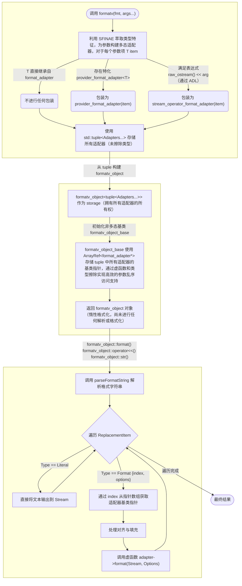

## 一、动机

最近我在开发 cxx-decorator 项目，该项目基于 ClangAST 和 libtooling 实现类似 Python 语言中的装饰器语法特性。

在开发期间，由于调试输出和日志记录等需求，需要频繁对 `SmallVector`、`StringRef`、`Decl*` 等 LLVM / ClangAST 核心类型进行格式化，原本我计划为这些类型实现 C++20 标准格式化支持（即 `std::format`），不过在分析设计如何将其与 LLVM 的 `raw_ostream` 体系合理集成时，我发现原来 LLVM 已经提供了一个功能完备的 `formatv` 格式化函数。

出于对 LLVM 如何实现类型安全格式化的好奇，也为了探究其与 `std::format` 在底层设计上的异同，我决定深入剖析其源码实现。

---

## 二、使用方式

在剖析实现之前，有必要简单介绍一下 `llvm::formatv` 的使用方式，总体而言与 `std::format` 非常相似，差异主要集中在在类型特定的格式符上。

---

### 基础示例

```cpp
// 位置索引
formatv("{0} {1}", "a", "bb")      // 输出："a bb"
// 参数复用
formatv("{0} {1} {0}", "a", "bb")  // 输出："a bb a"
// 布局控制（右对齐，宽度为 5，默认填充空格）
formatv("{0, +5}", "a")            // 输出："    a"
// 布局控制（居中，宽度为 5，填充字符'-'）
formatv("{0,-=5}", "a")            // 输出："--a--"
```

---

### 格式化字符串语法

`llvm::formatv` 使用包含替换序列（Replacement Sequence）的格式字符串，其核心语法结构如下：

```text
{ index [, layout] [: format] }
```

{: .nolineno }

1. 核心参数：
   - `index`**（必填）**：非负整数，对应参数包中参数的索引位置，同一索引可以在格式字符串中多次引用（如 `"{0} {1} {0}"`）。
   - `layout`（选填）：语法格式为 `[[char]loc]width`，用于控制输出内容的对齐、宽度和填充。
   - `format`（选填）：类型特定的格式化选项。

   > 与 `std::format` 和 `std::vformat` 不同，`llvm::formatv` 必须指定 `index`，否则行为未定义。
   > {: .prompt-warning }

2. 布局（`layout`）用于控制字段在可用空间内的展示方式，只有指定了 `width`，对齐和填充才会生效：
   - `width`：字段宽度。正整数，如果内容长度小于此值，将根据 `loc` 和 `char` 进行填充，否则直接输出内容，不进行填充。
   - `loc`：对齐位置。`-` 左对齐，`=` 居中对齐，`+` 右对齐。
   - `char`：填充字符。默认为空格。

 3. 转义字符：`{` 和 `}` 是保留字符，如果要在输出中包含大括号，必须进行转义，使用双大括号 `{{` 来输出一个 `{` 字面量。


---

### 内置格式化选项

`llvm::formatv` 的格式说明符（即 `{index:format}` 中的 `format` 部分）根据目标类型遵循不同的文法。

以下是核心类型的详细规则和示例：

---

#### 1. 整数类型（Integral）

整数的格式字符串文法为：**`[style][digits]`**

- `style`：决定输出格式。如十六进制、千分位等，见下表。
- `digits`：正整数（`0-99`）。对于十六进制（`x/X`），表示最小输出位数，如果数值长度不足，会在左侧补 `0`，对于其他样式，该参数被忽略。

| 样式（`style`） | 说明                        | 输入     | 格式串 | 输出      |
| :-------------- | :-------------------------- | :------- | :----- | :-------- |
| **`D` / `d`**   | 十进制（默认）              | `100000` | `D`    | `100000`  |
| **`N` / `n`**   | 千分位分隔                  | `123456` | `N`    | `123,456` |
| **`x+` / `x`**  | 十六进制（小写，`0x` 前缀） | `42`     | `x`    | `0x2a`    |
| **`X+` / `X`**  | 十六进制（大写，`0x` 前缀） | `42`     | `X+4`  | `0x002A`  |
| **`x-`**        | 十六进制（小写，无前缀）    | `42`     | `x-`   | `2a`      |
| **`X-`**        | 十六进制（大写，无前缀）    | `42`     | `X-`   | `2A`      |

---

#### 2. 浮点类型（Floating Point）

浮点数的格式字符串文法为：**`[style][precision]`**

- `style`：决定浮点数的表现形式。小数、百分比、科学计数，见下表。
- `precision`：正整数（`0-99`）。指定小数点后的位数，如果省略，科学计数法（`E/e`）默认为 6 位，其他（`F/P`）默认为 2 位。

| 样式（`style`） | 说明             | 输入    | 格式串 | 输出                   |
| :-------------- | :--------------- | :------ | :----- | :--------------------- |
| **`F` / `f`**   | 小数（默认）     | `1.0`   | `F`    | `1.00`（默认2位）      |
| **`P` / `p`**   | 百分比           | `0.05`  | `P`    | `5.00%`                |
| **`E`**         | 科学计数（大写） | `12345` | `E`    | `1.234500E+04`         |
| **`e`**         | 科学计数（小写） | `12345` | `e3`   | `1.235e+04`（指定3位） |

---

#### 3. 布尔类型（Boolean）

默认样式为 **`t`**，即：`true / false`

| 样式（`style`） | 说明                 | `true` 输出 | `false` 输出 |
| :-------------- | :------------------- | :---------- | :----------- |
| **`t`**         | true / false（默认） | `true`      | `false`      |
| **`T`**         | TRUE / FALSE         | `TRUE`      | `FALSE`      |
| **`y`**         | yes / no             | `yes`       | `no`         |
| **`Y`**         | YES / NO             | `YES`       | `NO`         |
| **`D` / `d`**   | 0 / 1                | `1`         | `0`          |

---

#### 4. 指针类型（Pointer）

指针主要按十六进制地址输出，文法结构类似整数。

| 样式（`style`） | 说明                     | 示例输出                    |
| :-------------- | :----------------------- | :-------------------------- |
| **`x` / `X`**   | 十六进制（带前缀，默认） | `0xdeadbeef` / `0xDEADBEEF` |
| **`x-` / `X-`** | 十六进制（无前缀）       | `deadbeef` / `DEADBEEF`     |

---

#### 5. 范围与容器（Ranges / Containers）

将任意 Ranges 打印为由 `separator` 分隔、以 `element_style` 指定的格式显示的元素序列，其 BNF 文法如下：

```haskell
range_style     ::= [separator] [element_style]
separator       ::= "$" delimeted_expr
element_style   ::= "@" delimeted_expr
delimeted_expr  ::= "[" expr "]" | "(" expr ")" | "<" expr ">"
expr            ::= <any string not containing delimeter>
```

- 分隔符（**`$`**）：插入在容器内相邻两个元素之间的字符串，未指定时默认以空格分隔。
- 元素样式（**`@`**）：指定容器内元素的格式说明符（即上述的整数、浮点等规则），未指定时以默认格式显示。

| 场景              | 格式串               | 说明                            | 示例输出 |
| :---------------- | :------------------- | :------------------------------ | :------- |
| 默认              | **`{0}`**            | 默认空格分隔，默认元素格式      | `255 10` |
| 分隔符            | **`{0:$[,]}`**       | 以逗号分隔                      | `255,10` |
| 元素格式          | **`{0:@[x-2]}`**     | 以小写十六进制并补齐到 2 位显示 | `ff 0a`  |
| 分隔符 + 元素格式 | **`{0:$[, ]@[X-]}`** | 以 `, ` 分隔，大写十六进制显示  | `FF, A`  |

---

## 三、实现解析


