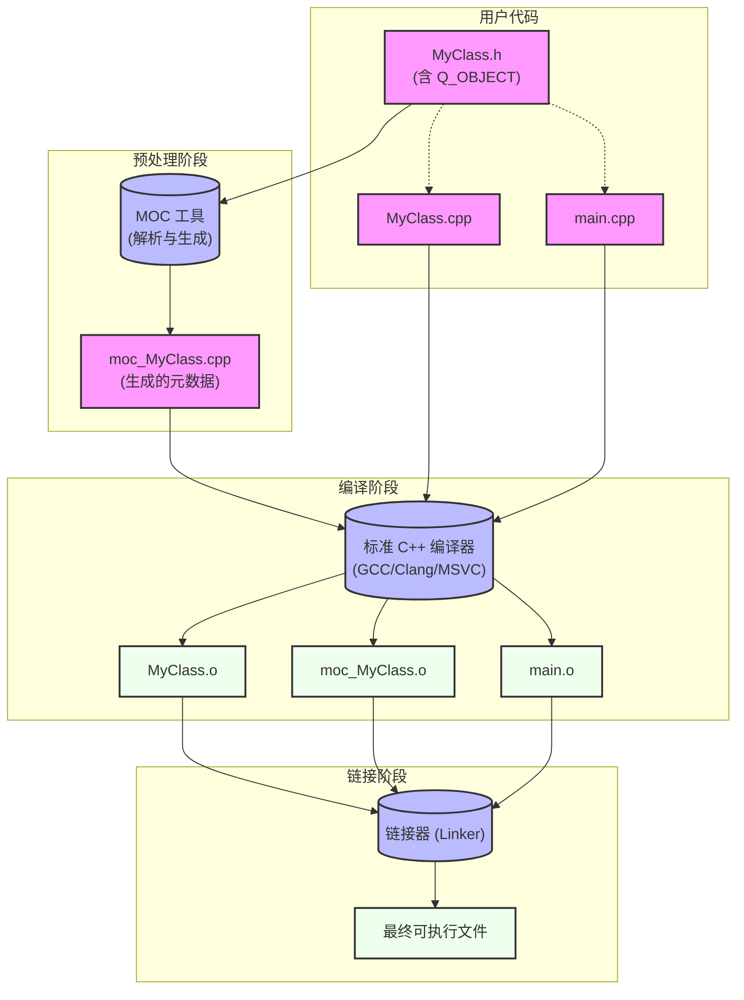
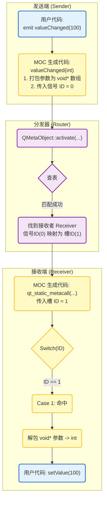

> 这会是一个文章系列，我希望能系统地剖析总结 Qt 6 元对象系统的实现原理和细节，本篇作为信号槽部分的开篇，先讲解 MOC 静态生成的部分，随后会分别剖析：
>   - `Connection` 和 `d_ptr` 中的 `ConnectionList`
>   - `QMetaCallEvent` 与跨线程调用时的参数拷贝问题
>   - `sender()` 的实现原理（即 TLS 或调用栈上下文注入）
>   - MOC 对 Lambda 和 Functor 的特殊处理
>
> 这些可能会分别放在剖析 `connect` 和 `activate` 的文章中。
{: .prompt-info }

---

## 一、元对象系统介绍

Qt 的元对象系统（Meta-Object System）是 Qt 框架的核心机制，它为 C++ 提供了内省（Introspection）和动态运行时功能。

由于标准 C++ 是静态编译语言，缺乏原生的反射机制，Qt 通过元对象系统弥补了这一“劣势”，实现了信号槽（Signals & Slots）、属性系统（Property System）以及运行时类型信息（RTTI）等功能。

这些机制的实现并不依赖于特殊的 C++ 编译器，而是通过一个名为 MOC（Meta-Object Compiler）的独立工具来完成。

MOC 本质上是一个代码生成器（Code Generator），在一个标准的 Qt 项目编译过程中，构建系统（无论是 CMake 还是 qmake）会安排 MOC 在标准 C++ 编译器介入之前运行。

---

我们可以通过一张流程图来理清这个流程：



---

具体步骤如下：

  1. 扫描：构建系统会检查头文件，如果 "MyClass.h" 中包含了 `Q_OBJECT` 宏，它就会被标记为“需要 MOC 处理”。

  2. 生成：moc 程序读取 "MyClass.h"，解析其中的类声明，它不关心函数体，只关心 `signals`, `slots`, `Q_PROPERTY` 等关键字，然后它生成一个全新的 C++ 源文件，通常命名为 "moc_MyClass.cpp"。

  3. 编译：标准编译器（如 g++ 或 cl.exe）不仅要编译 "MyClass.cpp"，还要编译由 MOC 生成的 "moc_MyClass.cpp"。

  4. 链接：链接器将这两部分对象文件合并，由于 `MyClass` 的虚函数（如 `metaObject()`）是在 "moc_MyClass.cpp" 中实现的，链接器会将它们整合到一起。

---

## 二、Qt 为静态的 C++ 注入动态性

至此，MOC 的任务在构建层面已经完成，通过预处理、生成、编译和链接这一整套流程，MOC 将类名、继承关系、函数签名等元信息注入到了最终的二进制文件中。

对于不少 Qt 开发者来说，这个 "moc_XXX.cpp" 文件往往是一个从未打开过的黑盒，但其中的元信息并非仅是躺在数据段里的静态数据，它们是 Qt 运行时功能的核心基础。

在 Qt 的众多特性中，信号槽（Signals & Slots）无疑是对元对象系统依赖最深、也是最能体现其设计哲学的机制。那么它是如何利用 MOC 生成的数据，在静态的 C++ 语言之上构建出一套动态的消息路由系统的？

我们将抛开复杂的宏定义，直接从 MOC 生成的底层代码入手，还原信号与槽的真实样子，通过解构这一机制，我们亦可管中窥豹，一探整个 Qt 元对象系统的运行机理。

---

### 1. 简单的计数器例子

为了搞清楚这一切，我们需要一个极其简单的例子，假设我们有一个计数器类 `Counter`：

```cpp
class Counter : public QObject
{
    Q_OBJECT

public:
    explicit Counter(QObject *parent = nullptr) : QObject(parent) {}

signals:
    // 信号只是声明，没有实现
    void valueChanged(int newValue);

public slots:
    // 槽函数是普通的 C++ 成员函数
    void setValue(int value) {
        // ... 业务逻辑 ...
    }
};
```

当我们运行 MOC 后，打开生成的 "moc_Counter.cpp"，所有的秘密都藏在两个关键函数的实现中。

生成的代码主要由两部分组成：**元数据**和**调用入口**。

---

### 2. 元数据：字符串与索引

首先，MOC 将类中所有的符号（类名、函数名、参数名）都提取出来，放入了一个字符串池中。

```cpp
QtMocHelpers::StringRefStorage qt_stringData {
    "Counter",
    "valueChanged",
    "",
    "newValue",
    "setValue",
    "value"
};
```

接着它定义了方法的元数据 `qt_methods`，注意，这里并没有函数指针，而是大量的 index：

```cpp
QtMocHelpers::UintData qt_methods {
    // 信号 `valueChanged`
    // 1=字符串索引("valueChanged"), 2=参数个数, QMC::AccessPublic=访问权限
    QtMocHelpers::SignalData<void(int)>(1, 2, QMC::AccessPublic, QMetaType::Void, ...),

    // 槽 `setValue`
    // 4=字符串索引("setValue")
    QtMocHelpers::SlotData<void(int)>(4, 2, QMC::AccessPublic, QMetaType::Void, ...),
};
```

这里体现出，索引（Index）在 MOC 机制中的核心地位：
  - 对于 `Counter` 类来说，`valueChanged` 是第 0 号元方法。
  - `setValue` 是第 1 号元方法。

---

### 3. 槽的调度器：`qt_static_metacall`

如果有谁想调用 `Counter` 的第 1 号方法（也就是 `setValue`），该怎么办？

由于 C++ 无法通过 `obj->call(1)` 来调用函数，MOC 生成了一个巨大的 `switch-case` 跳转表，这就是 `qt_static_metacall`：

```cpp
void Counter::qt_static_metacall(QObject *_o, QMetaObject::Call _c, int _id, void **_a)
{
    // 此处还原对象指针
    auto *_t = static_cast<Counter *>(_o);

    // 如果是“调用方法”的指令
    if (_c == QMetaObject::InvokeMetaMethod) {
        switch (_id) {
        // Case 0: 对应信号 `valueChanged`
        // 信号也可以被 invoke，这在信号转发（信号连接信号）时很有用
        case 0: _t->valueChanged((*reinterpret_cast<std::add_pointer_t<int>>(_a[1]))); break;

        // Case 1: 对应槽 `setValue`
        // 这就是 Qt 如何通过整数 ID 调用到对应 C++ 函数的
        case 1: _t->setValue((*reinterpret_cast<std::add_pointer_t<int>>(_a[1]))); break;

        default: ;
        }
    }
}
```

这段代码展示了 Qt 的动态性：
  1. 查表分发调用：通过 `switch(_id)` 将整数映射到具体的函数调用。
  2. 还原被擦除的类型：参数 `_a` 是一个 `void**`（`void` 指针数组），`_a[1]` 存放的是第一个参数的地址，代码通过 `reinterpret_cast` 将其强转回 `int*` 并解引用，以此还原参数类型。

---

### 4. 信号函数的实现：从 `emit` 到 `activate`

在 "Counter.h" 中，我们只声明了 `valueChanged` 信号，它的函数体是由 MOC 自动填充的：

```cpp
// SIGNAL 0
void Counter::valueChanged(int _t1)
{
    // 调用元对象系统的激活函数
    // 这里的数字 0 对应该信号在当前类中的相对索引
    QMetaObject::activate<void>(this, &staticMetaObject, 0, nullptr, _t1);
}
```

当我们调用 `emit valueChanged(42)` 时，实际上就是调用了这个函数。它随即调用了 `QMetaObject::activate`。

> 这里 Qt 6 使用了可变参数模板（Variadic Templates）来简化调用，这是相对于 Qt 5 的变化。
{: .prompt-tip }

---

我们来看看底层的 `activate` 模板实现：

```cpp
template <typename Ret, typename... Args>
static inline void activate(QObject *sender, const QMetaObject *mo, int local_signal_index, Ret *ret, const Args &... args)
{
    // 类型擦除，将所有参数的地址打包成一个 `void*` 数组
    void *_a[] = {
        const_cast<void *>(reinterpret_cast<const volatile void *>(ret)),                     // 存放返回值
        const_cast<void *>(reinterpret_cast<const volatile void *>(std::addressof(args)))...  // 存放参数地址
    };

    // 调用非模板版本的、真正的底层实现
    activate(sender, mo, local_signal_index, _a);
}
```

这一步至关重要。它完成了**“编译期类型”到“运行时通用指针”的转换**。无论信号的参数是 `int`、`QString` 还是自定义结构体，到了 `activate` 内部，它们都变成了统一的 `void*` 数组。这使得 Qt 的核心连接机制可以处理任意类型的信号槽，而无需为每种类型生成特定的代码。

## 三、小结

现在，我们可以把整个流程串联起来了。



以上就是信号槽（同时也是 MOC 机制）的初窥：
  - 编译期：MOC 扫描代码，将函数名转换为整数索引（0, 1, 2, ...），并生成负责“打包参数”的信号实现和负责“解包参数”的槽分发函数。
  - 运行期：`connect` 建立索引之间的映射，调用信号函数（如 `valueChanged`）实际上是进入了 MOC 生成的代码中，由它调用 `activate` 进行查表并转发。

通过这种方式，Qt 在静态的 C++ 语言之上，构建了一套高效的动态消息总线。

> **关于 `emit` 关键字**
>
> 在 Qt 的头文件中，`emit` 的定义是 `#define emit`（也就是空），这意味着 `emit valueChanged(10)` 和直接调用 `valueChanged(10)` 在编译后的二进制层面是完全一样的，Qt 保留 `emit` 不仅是为了代码可读性，也是对意图的明确表达，即区分“函数调用”和“信号发射”。
{: .prompt-tip }

