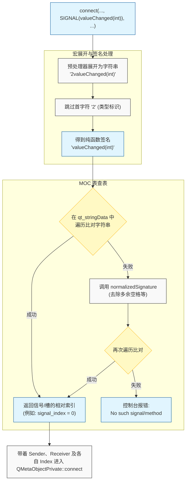
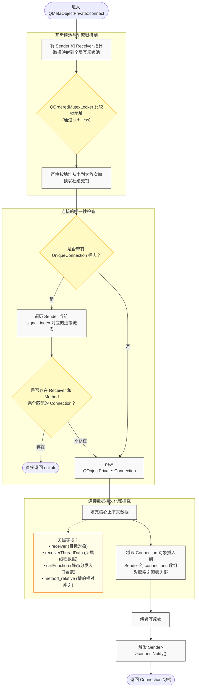

> **为什么要写这个番外篇**
>
> 这其实是一个老生常谈的话题，毕竟 `QObject::connect` 贯穿 Qt 应用始终，无论初学者还是高手都无时不刻不在使用它，但我觉得对于系列文章而言，它仍是不可缺少的一块拼图，也能从中窥得 MOC 系统的演进，同时也是梳理不同重载的使用场景，规避一些性能和安全性陷阱（没错说的就是你，**三参数 Lambda 重载**）。
{: .prompt-info }

---

## 一、前言

在深入研究 `QObject::connect` 那个复杂的实现源码之前，我们需要先停下来，整理一下它的外在表现。

如果翻看 "qobject.h" 头文件，可能会被那一堆 `connect` 的重载弄得眼花缭乱，归根结底，它们代表了 Qt 在不同 C++ 时代的演进逻辑。我们可以将它们分为四大流派，分别基于：
  - 字符串
  - 函数指针
  - 函数对象（Functor / Lambda）
  - 元对象（字符串本质基于此）

本篇我们将首先认识基于字符串的重载。

---

## 二、基于字符串的重载

这是最古老（Qt 4 时代）、最动态，同时也是开销最大的一种连接方式，它的函数签名如下：

```cpp
// 用法：connect(sender, SIGNAL(valueChanged(int)), receiver, SLOT(setValue(int)))
static QMetaObject::Connection
connect(const QObject *sender, const char *signal,
        const QObject *receiver, const char *method,
        Qt::ConnectionType type = Qt::AutoConnection);
```

---

### 1. SIGNAL 和 SLOT 宏的真面目

在进入函数体之前，我们先看传入的参数 `signal` 和 `method` 分别是什么。

在 "qobjectdefs.h" 中，`SIGNAL` 和 `SLOT` 宏分别被[定义为](https://github.com/qt/qtbase/blob/000d6c62f7880bb8d3054724e8da0b8ae244130e/src/corelib/kernel/qobjectdefs.h#L58)：

```cpp
...
# define QSLOT_CODE                 1
# define QSIGNAL_CODE               2
# define QT_PREFIX_CODE(code, a)    QT_STRINGIFY(code) #a
# define QT_STRINGIFY_SLOT(a)       QT_PREFIX_CODE(QSLOT_CODE, a)
# define QT_STRINGIFY_SIGNAL(a)     QT_PREFIX_CODE(QSIGNAL_CODE, a)
# define SLOT(a)                    QT_STRINGIFY_SLOT(a)
# define SIGNAL(a)                  QT_STRINGIFY_SIGNAL(a)
...
```

这意味着当写下 `SIGNAL(valueChanged(int))` 时，预处理器把它变成了字符串 `"2valueChanged(int)"`，同理，`SLOT(setValue(int))` 变成了 `"1setValue(int)"`。

字符串的第一个字符（0, 1, 2）标识了它的身份（Method, Signal, Slot）。

---

### 2. connect 函数内部的身份核验

在进入 `connect` 函数后，首先做的就是[检查这个前缀](https://github.com/qt/qtbase/blob/000d6c62f7880bb8d3054724e8da0b8ae244130e/src/corelib/kernel/qobject.cpp#L3011)：

```cpp
// 检查 `signal` 参数是否是用 `SIGNAL()` 宏包裹的（即首字符必须是 '2'）
if (!check_signal_macro(sender, signal, "connect", "bind"))
    return ...;

// 提取 `method` 的首字符（'1' 表示槽，'2' 表示信号）
int membcode = extract_code(method);

// 跳过首字符，指向真正的函数签名（如 "valueChanged(int)"）
++signal;
++method;
```

这一步保证了不能将一个 `SLOT` 宏误作 `signal` 参数传递。

---

### 3. 查表确定 Signal index

这是最耗时的一步，拿到 `"valueChanged(int)"` 这个字符串后，需要知道它在 `sender` 的元数据表中是第几个信号：

```cpp
// 解析签名，分离出函数名 "valueChanged" 和参数类型列表
QByteArrayView signalName = QMetaObjectPrivate::decodeMethodSignature(signal, signalTypes);

const QMetaObject *smeta = sender->metaObject();

// 去 MOC 生成的数据表里查找
int signal_index = QMetaObjectPrivate::indexOfSignalRelative(
        &smeta, signalName, signalTypes.size(), signalTypes.constData());
```

这里的 `indexOfSignalRelative` 会遍历我们在[上一篇]()看到的 `qt_stringData` 和 `qt_methods` 数组，逐个比对字符串，这是一个 O(N) 的线性查找过程。

> **关于 Normalization（规范化）**
>
> 代码中有一段 `if (signal_index < 0)` 的判断，如果手滑写了 `SIGNAL(valueChanged( int ))`，或者 `const int&` 写成了 `int`，第一次查找会失败。
>
> 但实现会调用 `normalizedSignature` 将其格式化为标准形式（去除多余空格等），然后再查找一次，这既是容错机制，也是字符串连接方式较慢的潜在因素之一。
{: .prompt-tip }

---

### 4. 查表确定 Method index

有了 Signal index，还需要找到 Receiver 侧的 index。

```cpp
switch (membcode) {
case QSLOT_CODE:
    // 如果目标是槽，则查找槽的索引
    method_index_relative = QMetaObjectPrivate::indexOfSlotRelative(...);
    break;
case QSIGNAL_CODE:
    // 如果目标也是信号（即信号连接信号），则查找信号的索引
    method_index_relative = QMetaObjectPrivate::indexOfSignalRelative(...);
    break;
}
```

这里解释了为什么 `connect` 可以连接两个信号，只要去查信号表而不是槽表就可以了。

---

### 5. 参数兼容性检查

找到两个 index 后，实现必须确保这次连接是安全的：

```cpp
if (!QMetaObjectPrivate::checkConnectArgs(signalTypes.size(), signalTypes.constData(),
                                          methodTypes.size(), methodTypes.constData())) {
    qCWarning(lcConnect, "QObject::connect: Incompatible sender/receiver arguments ...");
    return QMetaObject::Connection(nullptr);
}
```

这个函数会检查：
  - 信号的参数数量 >= 槽函数的参数数量
  - 信号和槽函数的所有参数类型相匹配

---

### 6. 交付底层

当一切检查通过，我们拿到了：Sender 指针、Signal 索引（`signal_index`）、Receiver 指针、Method 相对索引（`method_index_relative`）。

最后一行代码将这些处理好的参数交给真正的幕后函数：

```cpp
QMetaObject::Connection handle = QMetaObject::Connection(
    QMetaObjectPrivate::connect(sender, signal_index, smeta, receiver, method_index_relative, rmeta, type, types)
);
```

---

至此，字符串解析相关的部分就完成了，整体流程如图：



---

## 三、线程安全与 Connection 对象的构建

当字符串解析完毕，所有的函数名都被转换为具体的 index 后，`QObject::connect` 会将控制权交给底层的实现函数：`QMetaObjectPrivate::connect`。

该函数的核心任务是将连接关系持久化到内存中，由于 `connect` 提供了线程安全保证，因此在这个持久化过程中，必须处理并发写入和死锁问题。

---

### 1. 全局互斥锁池与死锁避免机制

在多线程环境中调用 `connect`，需要同时访问 Sender 和 Receiver 的内部数据结构，如果不加控制就易引发竞态条件。

但是为每个 `QObject` 实例分配一个独立的互斥锁又会导致巨大的内存开销，因此 Qt 采用了**全局互斥锁池（Mutex Pool）**的优化策略：

```cpp
static inline QBasicMutex *signalSlotLock(const QObject *o)
{
    return &_q_ObjectMutexPool[uint(quintptr(o)) % sizeof(_q_ObjectMutexPool)/sizeof(QBasicMutex)];
}
```

Qt 将 `QObject` 的指针地址（`quintptr(o)`）取模，映射到一个固定大小的全局互斥锁数组 `_q_ObjectMutexPool` 中，这种空间换时间的设计大幅降低了内存占用。

在获取了 Sender 和 Receiver 对应的互斥锁后，代码使用了 `QOrderedMutexLocker` 进行加锁：

```cpp
QOrderedMutexLocker locker(signalSlotLock(sender), signalSlotLock(receiver));
```

假设线程 1 执行 `connect(A, B)`，线程 2 同时执行 `connect(B, A)`，如果按照参数顺序加锁，线程 1 锁住 A 等待 B，线程 2 锁住 B 等待 A，将直接导致死锁。

`QOrderedMutexLocker` 的内部实现解决了死锁问题，它的构造函数核心逻辑如下：

```cpp
mtx1((m1 == m2) ? m1 : (std::less<QBasicMutex *>()(m1, m2) ? m1 : m2)),
mtx2((m1 == m2) ?  nullptr : (std::less<QBasicMutex *>()(m1, m2) ? m2 : m1)),
```

它利用 `std::less` 比较两个互斥锁指针的内存地址，始终先锁定内存地址较小的锁，再锁定内存地址较大的锁，这种基于绝对地址排序的加锁策略，杜绝了发生死锁的可能性，保证了多线程下的内存安全。

---

### 2. 唯一性检查（`Qt::UniqueConnection`）

在确定数据结构后，实现会处理 `Qt::UniqueConnection` 标志位，该标志位保证连接的唯一性。

> Qt 允许重复连接同一信号和槽，当信号被触发时会多次调用该槽函数。
{: .prompt-tip }

```cpp
QObjectPrivate::ConnectionData *scd  = QObjectPrivate::get(s)->connections.loadRelaxed();
if (type & Qt::UniqueConnection && scd) {
    if (scd->signalVectorCount() > signal_index) {
        const QObjectPrivate::Connection *c2 = scd->signalVector.loadRelaxed()->at(signal_index).first.loadRelaxed();
        int method_index_absolute = method_index + method_offset;

        while (c2) {
            if (!c2->isSlotObject && c2->receiver.loadRelaxed() == receiver && c2->method() == method_index_absolute)
                return nullptr;   // 如果已连接就直接返回
            c2 = c2->nextConnectionList.loadRelaxed();
        }
    }
}
```

代码通过读取 Sender 的 `connections` 数据，定位到对应 `signal_index` 的连接表并对其进行遍历，条件判断 `!c2->isSlotObject` 表明当前查找仅针对传统的索引型连接（排除 Functor/Lambda 类型的连接），如果检测到 `receiver` 指针和 `method_index_absolute` 完全匹配，则终止连接建立，返回 `nullptr`。

> 此处大量使用了 `loadRelaxed()` 原子操作，由于此部分逻辑已经由 `QOrderedMutexLocker` 保护，因此使用 Relaxed 内存序足以保证正确性且开销最小。
{: .prompt-tip }

---

### 3. 创建 Connection 并挂载

当检查全部通过后，Qt 开始在堆上分配并初始化代表本次连接的物理实体 —— `QObjectPrivate::Connection` 结构体。

```cpp
std::unique_ptr<QObjectPrivate::Connection> c{new QObjectPrivate::Connection};
c->sender = s;
c->signal_index = signal_index;
c->receiver.storeRelaxed(r);

// 记录 Receiver 所在的线程数据
QThreadData *td = r->d_func()->threadData.loadAcquire();
td->ref();
c->receiverThreadData.storeRelaxed(td);

c->method_relative = method_index;
c->method_offset = method_offset;
c->connectionType = type;
c->isSlotObject = false;
c->argumentTypes.storeRelaxed(types);
c->callFunction = callFunction;   // 存储 MOC 生成的 `qt_static_metacall` 函数指针
```

该结构体记录了信号触发时所需的所有上下文信息，其中有两个关键字段：
  - `receiverThreadData`：记录建立连接时 Receiver 所属的线程上下文（并通过 `ref()` 增加引用计数），在信号触发并执行跨线程的 `QueuedConnection` 时，Qt 依赖该字段将事件投递到正确的线程事件循环中。
  - `callFunction`：指向了 Receiver 对应的 `qt_static_metacall` 函数，这是将索引转换为实际 C++ 函数调用的入口点（上一篇中提到过）。

实例化完成后，代码将其挂载到 Sender 的内部数据结构中：

```cpp
QObjectPrivate::get(s)->addConnection(signal_index, c.get());
```

`addConnection` 会将这个 `Connection` 对象插入到 Sender 的指定 `signal_index` 对应的表中，当信号被触发时，底层 `activate` 函数正是通过遍历这张表，逐一取出 `Connection` 对象并执行调用的。

最后，解锁互斥锁，并触发 `connectNotify` 虚函数，这允许开发者在对象被连接时执行自定义的业务逻辑回调：

```cpp
locker.unlock();
QMetaMethod smethod = QMetaObjectPrivate::signal(smeta, signal_index);
if (smethod.isValid())
    s->connectNotify(smethod);
return c.release();
```

---

这部分的整体流程如下图：



---

## 四、小结

至此，基于字符串的 `QObject::connect` 执行链路已分析完毕，该重载版本的核心设计思想可以总结为：在运行时进行字符串签名匹配，提取 MOC 元数据表中的相对索引，最终构建并存储基于索引调用的 Connection 数据结构。

这种设计的优势在于其极高的动态性。调用者无需在编译期引入 Receiver 的具体类型定义，仅依靠基类指针 `QObject*` 和字符串即可完成连接，这为 Qt 的插件系统、动态库加载以及 QML 脚本绑定提供了底层支撑。

不过，这种基于纯运行时的实现机制也暴露了一些局限性：
  - 静态类型不安全：所有参数的校验均推迟至运行期，如果函数签名拼写错误或类型不匹配，编译器无法提供任何提示和警告，增加了 BUG 的排查成本。
  - 额外的运行时开销：连接阶段需要进行大量的字符串解析、内存分配（`QByteArray`）以及 MOC 表的线性查找，对高频建立/销毁连接的场景性能不友好。

随着 C++ 标准的演进，Qt 5 引入了基于模板的成员函数指针（PMF）重载，也加入了对 Lambda 表达式和 Functor 的支持。

这些现代重载与字符串重载互补，为 `connect` 引入了静态安全性，这部分实现原理我们将在后续文章中进行拆解。
