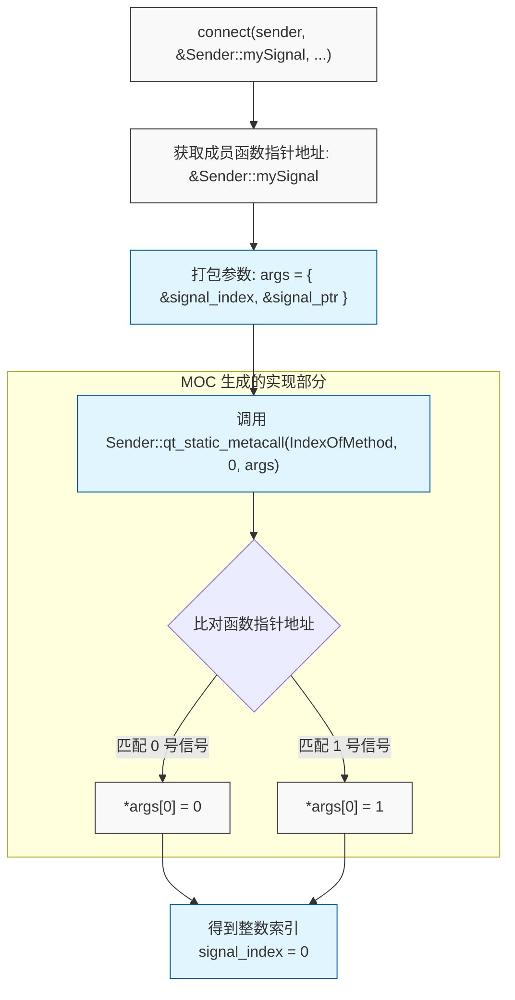
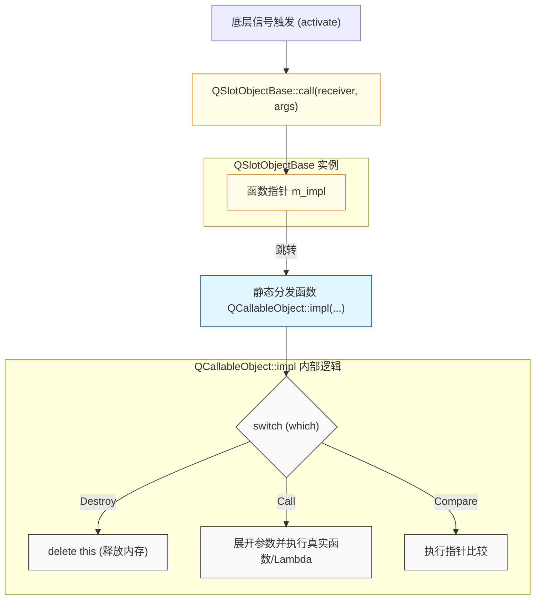

> **前情提要**
>
> 在[上一篇]()中，我们详细拆解了基于字符串的 `connect` 重载，它虽然高度动态化，但也伴随着运行时开销大、缺乏类型检查的问题。本篇将分析 Qt 5 引入并在 Qt 6 中进一步完善的现代重载版本：基于函数指针（PMF）与函数对象（Functor/Lambda）的连接实现。
{: .prompt-info }

---

## 一、前言

现代 C++ 风格的 `connect` 重载允许我们直接传递成员函数指针或 Lambda 表达式，这种方式不仅在编译期提供了严格的类型检查，还在运行时免去了昂贵的字符串匹配开销。

为了实现这一目标，Qt 内部使用了大量的模板元编程（Template Metaprogramming, aka TMP）和类型擦除（Type Erasure）技术，我们将沿着源码的调用链，分为三个核心阶段进行剖析：**编译期类型校验**、**信号索引解析** 以及 **SlotObj 的封装与持久化**。

---

## 二、编译期类型校验

当我们编写 `connect(sender, &Sender::signal, receiver, &Receiver::slot)` 时，最先进入的是一个复杂的[函数模板](https://github.com/qt/qtbase/blob/000d6c62f7880bb8d3054724e8da0b8ae244130e/src/corelib/kernel/qobject.h#L228)：

```cpp
template <typename Func1, typename Func2>
static inline QMetaObject::Connection
connect(const typename QtPrivate::FunctionPointer<Func1>::Object *sender, Func1 signal,
        const typename QtPrivate::ContextTypeForFunctor<Func2>::ContextType *context, Func2 &&slot,
        Qt::ConnectionType type = Qt::AutoConnection)
{
    typedef QtPrivate::FunctionPointer<Func1> SignalType;
    typedef QtPrivate::FunctionPointer<std::decay_t<Func2>> SlotType;

    // 1. 检查参数兼容性与返回值
    if constexpr (SlotType::ArgumentCount != -1) {
        static_assert((QtPrivate::AreArgumentsCompatible<typename SlotType::ReturnType, typename SignalType::ReturnType>::value),
                        "Return type of the slot is not compatible with the return type of the signal.");
    } else {
        // 针对 Functor/Lambda 的参数推导与检查
        constexpr int FunctorArgumentCount = QtPrivate::ComputeFunctorArgumentCount<std::decay_t<Func2>, typename SignalType::Arguments>::Value;
        // ... (推导返回值并进行 static_assert 检查)
    }

    // 2. 检查 Q_OBJECT 宏
    static_assert(QtPrivate::HasQ_OBJECT_Macro<typename SignalType::Object>::Value,
                      "No Q_OBJECT in the class with the signal");

    // 3. 参数数量检查
    static_assert(int(SignalType::ArgumentCount) >= int(SlotType::ArgumentCount),
                      "The slot requires more arguments than the signal provides.");
    // ...
```

这里的核心机制是特征类（Traits） `QtPrivate::FunctionPointer`，它在编译期将传入的函数指针通过模板偏特化，提取出所属的类（`Object`）、参数个数（`ArgumentCount`）、参数类型列表（`Arguments`）以及返回值类型（`ReturnType`）。

随后，通过一系列的 `static_assert`，Qt 确保了：
  1. 信号所属的类必须包含 `Q_OBJECT` 宏。
  2. 信号提供的参数数量必须大于等于槽函数需要的参数数量。
  3. 参数的类型必须能够隐式转换。

这些检查将所有可能的类型不匹配错误提前到了编译期，解决了字符串版本在运行时才会报错的安全隐患。

---

## 三、函数指针到整数索引

在通过编译期校验后，代码继续向下执行，准备进入底层的通用实现。

对于接收侧（Slot），Qt 使用 `QtPrivate::makeCallableObject` 将传入的函数指针或 Lambda 包装成一个多态对象（将在稍后详述），随后，控制权交给了 `QObject::connectImpl` 函数：

```cpp
    // ...
    return connectImpl(sender, reinterpret_cast<void **>(&signal), context, pSlot,
                       QtPrivate::makeCallableObject<Func1>(std::forward<Func2>(slot)),
                       type, types, &SignalType::Object::staticMetaObject);
}
```

进入 `QObject::connectImpl` 后，面临一个关键问题：底层数据结构依然是以整数 `signal_index` 为主键的，而我们手中现在只有信号的成员函数指针（`signal`），那该如何获取它的索引？

这部分逻辑就依赖于 MOC 生成代码的配合：

```cpp
QMetaObject::Connection QObject::connectImpl(const QObject *sender, void **signal,
                                             const QObject *receiver, void **slot,
                                             QtPrivate::QSlotObjectBase *slotObjRaw, Qt::ConnectionType type,
                                             const int *types, const QMetaObject *senderMetaObject)
{
    QtPrivate::SlotObjUniquePtr slotObj(slotObjRaw);
    if (!signal) {
        connectWarning(sender, senderMetaObject, receiver, "invalid nullptr parameter");
        return QMetaObject::Connection();
    }

    int signal_index = -1;
    // 构建一个参数数组，准备传给 static_metacall
    void *args[] = { &signal_index, signal };

    // 沿着类的继承链向上查找
    for (; senderMetaObject && signal_index < 0; senderMetaObject = senderMetaObject->superClass()) {
        // 调用 MOC 生成的静态分发函数，传入 IndexOfMethod 指令
        senderMetaObject->static_metacall(QMetaObject::IndexOfMethod, 0, args);
        if (signal_index >= 0 && signal_index < QMetaObjectPrivate::get(senderMetaObject)->signalCount)
            break;
    }

    // ... 处理未找到信号的错误 ...

    signal_index += QMetaObjectPrivate::signalOffset(senderMetaObject);
    return QObjectPrivate::connectImpl(sender, signal_index, receiver, slot, slotObj.release(), type, types, senderMetaObject);
}
```

这里体现了我们在[系列第一篇]()中看到的 `qt_static_metacall` 的另一个功能：`QMetaObject::IndexOfMethod`。

MOC 在生成代码时，不仅生成了通过 ID 调用函数的 `InvokeMetaMethod` 分支，还生成了通过比对函数指针地址来反向查找 ID 的分支。

上述代码将成员函数指针传递给 `static_metacall`，查表比对地址，如果匹配，则将对应的 `signal_index` 写入 `args[0]` 中。

> **跨平台的成员函数指针比较**
>
> C++ 标准对成员函数指针（PMF）的比较有严格的限制，且不同编译器（如 MSVC 与 GCC/Clang）对 PMF 的内部内存布局和大小实现具有差异（从 8 字节到 24 字节不等），MOC 生成的代码在处理 `IndexOfMethod` 指令时，实际上是在内部生成了一套强类型的跨平台 PMF 比较代码，从而安全地映射到对应的 `signal_index`。
{: .prompt-tip }

> **索引解析开销**
>
> 相比于直接传索引，`static_metacall` 反向解析索引需要遍历比对函数指针地址，依然存在一定的运行时开销，但这个动作仅在建立连接（`connect` 时）执行一次。当信号真正触发（`emit`）时，底层直接使用已记录的 `signal_index` 进行寻址，保证了高频触发时的性能。
{: .prompt-tip }



通过这种机制，Qt 巧妙地在不使用任何字符串比较的情况下，以极低开销完成了信号索引的解析。

---

## 四、类型擦除与 SlotObj 挂载

当获取到绝对的 `signal_index` 后，执行流进入最终的 `QObjectPrivate::connectImpl`。

注意，这个函数并非我们在上一篇看到的那个处理字符串重载的同名函数。虽然它们处理锁和 `Qt::UniqueConnection` 的逻辑完全一致，但在构建 `Connection` 结构时两者存在一些差异：

```cpp
QMetaObject::Connection QObjectPrivate::connectImpl(const QObject *sender, int signal_index,
                                             const QObject *receiver, void **slot,
                                             QtPrivate::QSlotObjectBase *slotObjRaw, int type,
                                             const int *types, const QMetaObject *senderMetaObject)
{
    // ... 参数校验
    // ... QOrderedMutexLocker 申请双锁
    // ... Qt::UniqueConnection 唯一性检查（此处比对的是 slotObj->compare(slot)）

    // 构建 Connection 对象
    std::unique_ptr<QObjectPrivate::Connection> c{new QObjectPrivate::Connection};
    c->sender = s;
    c->signal_index = signal_index;

    QThreadData *td = r->d_func()->threadData.loadAcquire();
    td->ref();
    c->receiverThreadData.storeRelaxed(td);
    c->receiver.storeRelaxed(r);
    c->connectionType = type;

    // 此处有差异
    c->isSlotObject = true;           // 标记这是一个基于 SlotObj 的连接
    c->slotObj = slotObjRaw;          // 存储类型擦除后的多态对象

    if (types) {
        c->argumentTypes.storeRelaxed(types);
        c->ownArgumentTypes = false;
    }
    c->isSingleShot = isSingleShot;

    // 挂载到 Sender 的连接链表
    QObjectPrivate::get(s)->addConnection(signal_index, c.get());

    // ... 解锁与触发 connectNotify
    return ret;
}
```

---

### SlotObj 的本质

在基于字符串的连接中，`Connection` 对象存储的是接收者的 `method_relative`（相对索引）和 `callFunction`（指向 `qt_static_metacall`）。

但在现代重载中，接收端可能是一个 Lambda 表达式，它没有类、没有对象名、也没有 MOC 为其生成的索引，为了统一调度，Qt 引入了 `QSlotObjectBase` 进行类型擦除。

分析 `QSlotObjectBase` 的源码，可以发现一个非常注重性能的设计，即它没有使用 C++ 的 `virtual` 虚函数来实现多态：

```cpp
class QSlotObjectBase
{
    // 源码注释翻译：
    // 不要在这里使用虚函数；我们不希望编译器生成大量我们永远不需要的、
    // 针对每个多态类的额外数据（指 vtable 和 RTTI）。
    // 我们仅使用一个函数指针，并结合 Operations 枚举来区分不同的请求。

    using ImplFn = void (*)(QSlotObjectBase* this_, QObject *receiver, void **args, int which, bool *ret);
    const ImplFn m_impl;
    QAtomicInt m_ref = 1;

protected:
    enum Operation { Destroy, Call, Compare, NumOperations };

public:
    explicit QSlotObjectBase(ImplFn fn) : m_impl(fn) {}

    inline void destroyIfLastRef() noexcept
    { if (!m_ref.deref()) m_impl(this, nullptr, nullptr, Destroy, nullptr); }

    inline bool compare(void **a)
    {
        bool ret = false;
        m_impl(this, nullptr, a, Compare, &ret);
        return ret;
    }
    inline void call(QObject *r, void **a)  { m_impl(this, r, a, Call, nullptr); }
};
```

### 为什么放弃虚函数？

由于 C++ 的 Lambda 表达式每一个都具有单独的类型，如果采用标准面向对象的设计（如定义 `virtual void call() = 0`），编译器就会为代码中出现的每一个 Lambda 实例所在的模板类生成一张虚函数表（vtable）和 RTTI 数据，在包含大量信号槽连接的大型项目中，这会导致严重的二进制膨胀。

### C 风格的静态分发

为了解决这个问题，Qt 采用了类似 C 语言的函数指针方案。`QCallableObject` 是实际存储 Lambda 或函数指针的模板派生类：

```cpp
template <typename Func, typename Args, typename R>
class QCallableObject : public QSlotObjectBase,
                        private QtPrivate::CompactStorage<std::decay_t<Func>>
{
    // ...
    // 这是一个静态函数，不会生成虚表
    Q_DECL_HIDDEN static void impl(QSlotObjectBase *this_, QObject *r, void **a, int which, bool *ret)
    {
        const auto that = static_cast<QCallableObject*>(this_);
        switch (which) {
        case Destroy:
            delete that; // 清理 Lambda 捕获的上下文
            break;
        case Call:
            // 实际执行槽函数调用
            if constexpr (std::is_member_function_pointer_v<FunctorValue>)
                FuncType::template call<Args, R>(that->object(), static_cast<typename FuncType::Object *>(r), a);
            else
                FuncType::template call<Args, R>(that->object(), r, a);
            break;
        case Compare:
            // 仅成员函数指针支持比较，Lambda 无法比较
            if constexpr (std::is_member_function_pointer_v<FunctorValue>) {
                *ret = *reinterpret_cast<FunctorValue *>(a) == that->object();
                break;
            }
            Q_FALLTHROUGH();
        case NumOperations:
            Q_UNUSED(ret);
        }
    }
public:
    explicit QCallableObject(Func &&f) : QSlotObjectBase(&impl), Storage{std::move(f)} {}
};
```

在构造 `QCallableObject` 时，它将自己的静态函数 `impl` 的地址传给了基类 `QSlotObjectBase` 的 `m_impl` 字段。

当信号触发需要调用该槽时，底层直接调用 `QSlotObjectBase::call`，该函数进而通过 `m_impl` 指针路由回具体的静态 `impl` 函数，通过 `switch(which)` 执行相应的操作。

> **尾调用优化（Tail Call Optimization, aka TCO）**
>
> 注意 `impl` 静态函数的签名设计：它将比较结果通过指针参数 `bool *ret` 传递，并将函数自身的返回类型设为 `void`，根据 Qt 源码的内部注释，这种规避直接返回值的做法，是为了在特定路径上使编译器能够执行尾调用优化，从而在频繁触发信号时减少调用栈的层级与开销。
{: .prompt-info }



同时，`impl` 函数内部针对 `Compare` 操作的实现，也解释了为何 `Qt::UniqueConnection` 在面对 Lambda 表达式时存在局限性：由于 Lambda 表达式在 C++ 标准中无法进行相等性比较，代码在这里针对非成员函数指针类型直接使用了 `Q_FALLTHROUGH()`，使得比较操作默认返回 `false`。

---

## 五、 Context 对象和 Contextless 连接

在理解了 `QSlotObjectBase` 的多态封装和挂载机制后，还需要注意一下 Connection 对象的生命周期管理与线程关联性，这涉及 `connect` 函数模板中 `context` 参数的具体作用，以及三参数重载存在的一些隐患。

### Contextless 连接的底层行为

Qt 提供了一个省略 `context` 参数的三参数重载版本，用于直接连接信号与 Lambda 表达式。其内部源码实现如下：

```cpp
#ifndef QT_NO_CONTEXTLESS_CONNECT
    // connect without context
    template <typename Func1, typename Func2>
    static inline QMetaObject::Connection
        connect(const typename QtPrivate::FunctionPointer<Func1>::Object *sender, Func1 signal, Func2 &&slot)
    {
        return connect(sender, signal, sender, std::forward<Func2>(slot), Qt::DirectConnection);
    }
#endif // QT_NO_CONTEXTLESS_CONNECT
```

可以看出，当省略 `context` 时 Qt 内部实际执行了两个操作：
  1. 将 `sender` 指针本身作为 `context`（即内部构建 `Connection` 对象时的 `receiver` 字段）传入。
  2. 强制指定连接类型为 `Qt::DirectConnection`。

### 生命周期管理与悬垂指针

在 Qt 的对象模型中，`Connection` 的生命周期由 `sender` 和 `receiver`（即 `context`）共同约束。当两者中任意一个对象被销毁时，`QObject` 析构函数会自动遍历并清理相关联的连接表，以断开连接。

在三参数重载中，由于 `context` 被硬编码为 `sender`，该连接的生命周期被完全绑定在发送者单一对象上。

如果传入的 Lambda 表达式内部捕获了外部变量（典型如 `this` 指针），且该外部对象的生命周期短于 `sender`，那么即使该对象已销毁，连接却依然保持有效。

后续 `sender` 触发信号时，底层调用 `SlotObj->call(...)` 执行 Lambda 将直接访问已释放的内存（悬垂指针），导致程序崩溃。

标准的四参数重载通过允许显式传入 `context` 对象，使得当 `context` 销毁时连接自动断开，从机制上避免了生命周期陷阱。

### 线程调度与数据竞争

除了生命周期，`context` 还决定了跨线程信号投递时的目标事件循环。

我们在前文的 `QObjectPrivate::connectImpl` 源码中看到，底层构建 `Connection` 对象时，会读取 `receiver` 所在线程的 `QThreadData` 并保存。

对于默认的 `AutoConnection`，当信号发射时，底层 `activate` 机制会比对 Sender 所在线程与 `receiver` 所在线程，若二者不一致，则会将 Lambda 包装为 `QMetaCallEvent`，投入 `receiver` 所在线程的事件队列中执行（即 `QueuedConnection`），从而保证线程安全。

然而，三参数重载内部强制硬编码了 `Qt::DirectConnection`，这意味着它完全跳过了上述的线程关联性检查和事件队列投递机制，无论信号在哪个线程发射，Lambda 都会在信号发射的当前线程内同步执行。

如果在后台工作线程中触发了该信号，而 Lambda 内部访问了主线程的 UI 组件或与其他线程共享的数据，且缺乏互斥锁等同步原语的保护，将直接引发数据竞争（Data Race）或竞态条件（Race Condition），这属于未定义行为（UB），会导致内存数据错误或程序崩溃。

### 严格模式（Strict Mode）下的规避方案

由于 Contextless 重载在实际工程中容易引发内存安全和线程安全问题，Qt 官方引入了宏控制废弃该重载。

从 Qt 6.7 开始，官方引入了 `QT_NO_CONTEXTLESS_CONNECT` 宏，在 Qt 6.8 中，官方进一步引入了 `QT_ENABLE_STRICT_MODE_UP_TO` 宏，该宏用于禁用版本历史中被认定为次优或存在潜在危险的 API 集合。

在项目的构建配置中启用严格模式（比如定义 `QT_ENABLE_STRICT_MODE_UP_TO=0x060700` 或更高版本）时，`qtconfigmacros.h` 中的预处理逻辑会自动拦截并定义屏蔽宏：

```cpp
#if QT_ENABLE_STRICT_MODE_UP_TO >= QT_VERSION_CHECK(6, 7, 0)
# ifndef QT_NO_CONTEXTLESS_CONNECT
#  define QT_NO_CONTEXTLESS_CONNECT
# endif
#endif // 6.7.0
```

当 `QT_NO_CONTEXTLESS_CONNECT` 生效后，前文提及的三参数重载模板函数将不参与编译，这一设计表明，明确传递上下文对象（四参数重载）才是现代 Qt 开发中的正确实践。

---

## 五、小结

综上所述，现代 C++ 风格的 `connect` 重载在底层主要依赖以下机制的配合：
  - 编译期类型校验：利用模板推导和 `static_assert`，完成了信号与槽参数的静态类型检查。
  - MOC 辅助解析：通过向 `static_metacall` 传递特定指令，将函数指针反向解析为整数信号索引，实现高效寻址。
  - 轻量多态机制：通过 `QSlotObjectBase` 统一封装各类可调用对象，并使用静态函数指针加枚举分支的 C 风格分发机制，规避了虚表产生的二进制膨胀问题。
  - 生命周期与异步安全性：明确了显式传递 Context 对象的必要性，通过将连接生命周期与上下文对象生命周期绑定，并依托事件队列进行线程调度，消除了 Lambda 闭包带来的悬垂指针和数据竞争隐患，该规范在 Qt 6 的严格模式（Strict Mode）下获得了框架层面的保障。

这种设计在兼容基于 `signal_index` 的底层挂载体系的同时，也带来了类型安全与更高的执行效率，更为复杂的多线程和闭包场景提供了内存与并发安全性支持。
